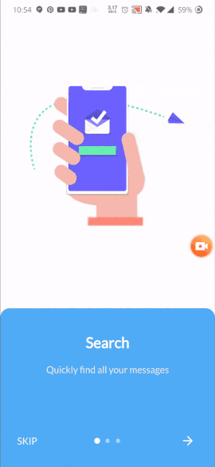
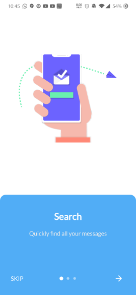

# nice_intro

Get your users to know your app with ease

## Getting Started

Onboarding is a great way to introduce your app to newcomers, to help them quickly adapt to the new conditions so that they can get the most out of your app


[](https://paypal.me/devEnthusiast?locale.x=en_US)

A Flutter package to build awesome intro slides for your apps.

## Demo

This is somehow what you can expect from this package :)




## Installation

Add the following to pubspec.yaml:

```yaml
dependencies:
  nice_intro: ^0.1.3
```

## Usage Example

First, import the following files

```dart
import 'package:nice_intro/intro_screen.dart';
import 'package:nice_intro/intro_screens.dart';
```

Then, create a list of screens each one with the `IntroSreen` class:

```
List<IntroScreen> pages =  [
        IntroScreen(
          title: 'Search',
          imageAsset: 'assets/img/1.png',
          description: 'Quickly find all your messages',
          headerBgColor: Colors.white,
        ),
        IntroScreen(
          title: 'Focused Inbox',
          headerBgColor: Colors.white,
          imageAsset: 'assets/img/2.png',
          description: "We've put your most important, actionable emails here",
        ),
        IntroScreen(
          title: 'Social',
          headerBgColor: Colors.white,
          imageAsset: 'assets/img/3.png',
          description: "Keep talking with your mates",
        ),
      ];

```

You'll come up with a list of nice slides screens.

Finally, pass the pages to an instance of `IntroScreens class`:

```
IntroScreens introScreens = IntroScreens(
      footerBgColor: TinyColor(Colors.blue).lighten().color,
      activeDotColor: Colors.white,
      footerRadius: 18.0,
      indicatorType: IndicatorType.CIRCLE,
      pages:pages

    return Scaffold(
      body: introScreens,
    );
```
And pass it to your scaffold widget.

### Documentation

#### IntroScreen widget's properties

| Name  |  Type |  Default | Description |
|---|---|---|---|
|  title | `String`  | required  |Set the title of your slide  screen   |
| description  | `String`  | required | Set the description of your slide screen  |
| imageAsset  |`String`   | required | Set the image path of your slide screen  |
| textStyle  |`TextStyle`  | null  | Set the style of the title and description of your slide|
| headerBgColor  | `Color` | `Colors.white`  | Set the background color of the slide  |
| headerPadding  | `EdgeInsets`  |  `EdgeInsets.all(12)` |  Set the padding of the header part of your slide screen  |

#### IntroScreens widget's properties

| Name  |  Type |  Default | Description |
|---|---|---|---|
| slides | `List<IntroScreen>`  | required  | list of your slides |
| onDone | `Function`  | required |  Set the action to do when the last slide is reached |
| onSkip | `Function`  |  required |  Set the action to do when the user skips the slides |
| footerRadius | `double`  |12.0  | Set the radius of the footer part of your slides  |
| footerBgColor |`Color`   | `Color(0xff51adf6)`  |Set the background color of the footer part of your slides  |
| footerGradients |`List<Color>`   | <Color>[]  |Set the list of colors for the gradient of the footer part of your slides  |
| footerPadding | `EdgeInsets`  |  `EdgeInsets.all(24)` |  Set the padding of the footer part of your slides |
| indicatorType | `IndicatorType`  |`IndicatorType.CIRCLE` |  Set the type of indicator for your slides  |
| activeDotColor |`Color`   |`Colors.white` |Set the color of the active indicator color|
| inactiveDotColor |`Color` | null | Set the color of an inactive indicator color |
| skipText  | `String` |  "Skip" | Set the text of the skip widget |
| nextWidget | `Widget`  || Set the widget to use for next interaction of your slides|
| doneWidget | `Widget`  || Set the widget to display when the last slide is reached|
| viewPortFraction  | `double`  |  1.0 |  Set the viewport fraction of your slides |
| textColor | `Color`  |`Colors.white` |  Set the text color of the footer part of your slides  |
| physics | `ScrollPhysics` |`BouncingScrollPhysics` |  Set the physics for the page view  |

#### IndicatorType enum properties

* IndicatorType.CIRCLE
* IndicatorType.LINE
* IndicatorType.DIAMOND

Now enjoy!

**Refer to [example folder](example/README.md) and the source code for more information.**
